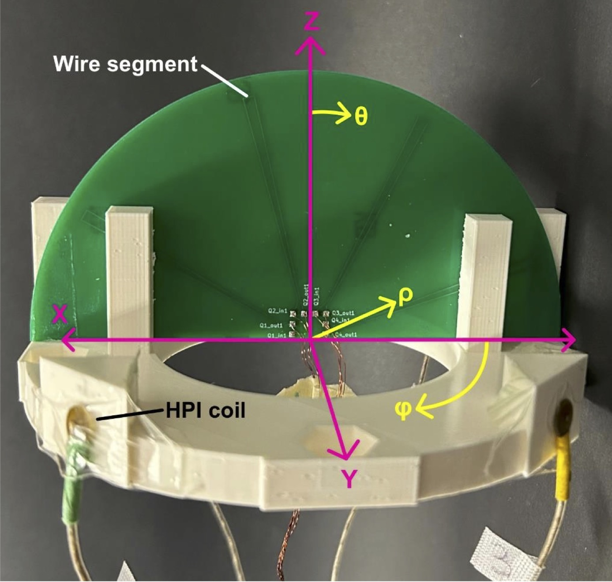
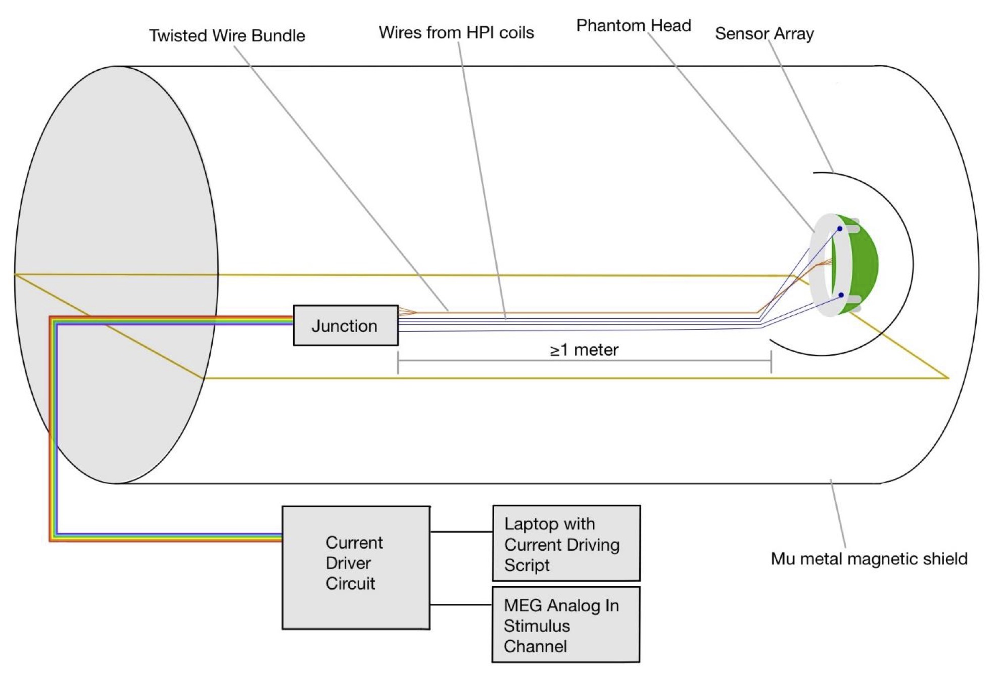
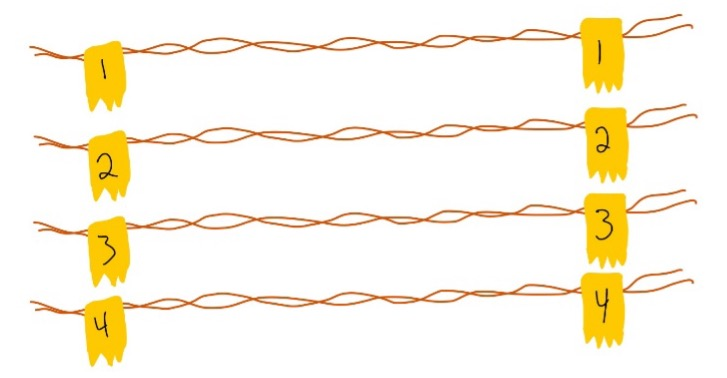
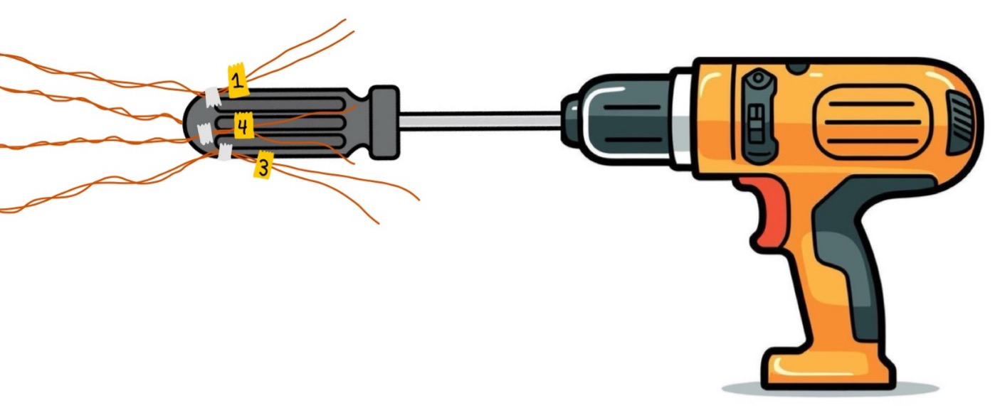
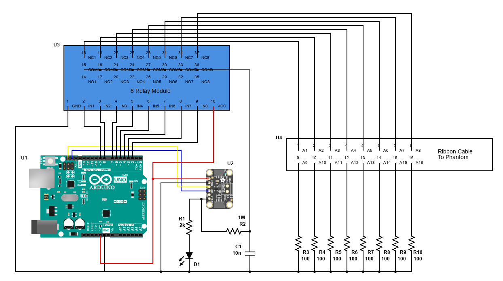
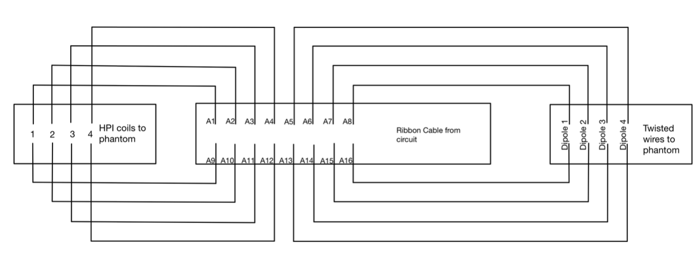
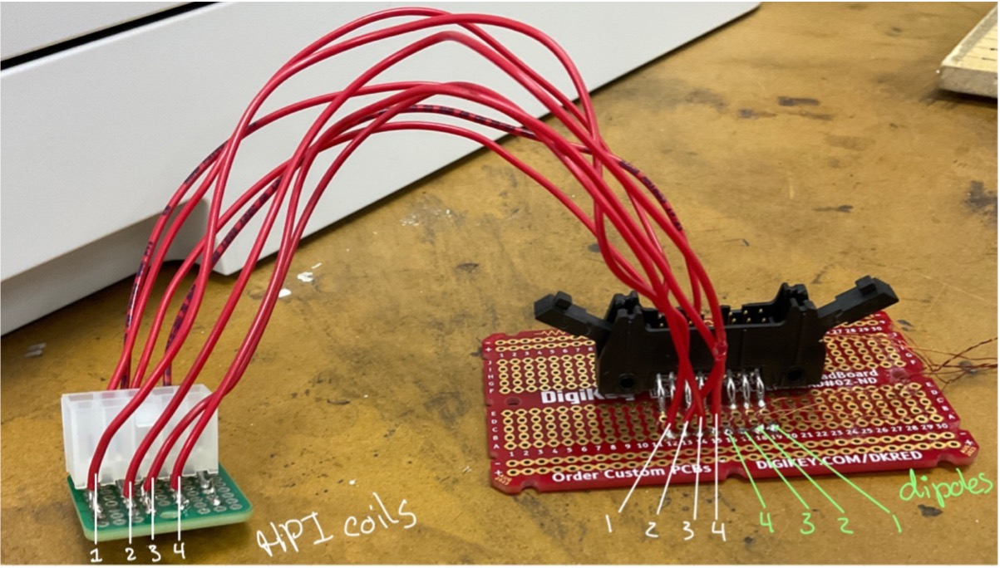
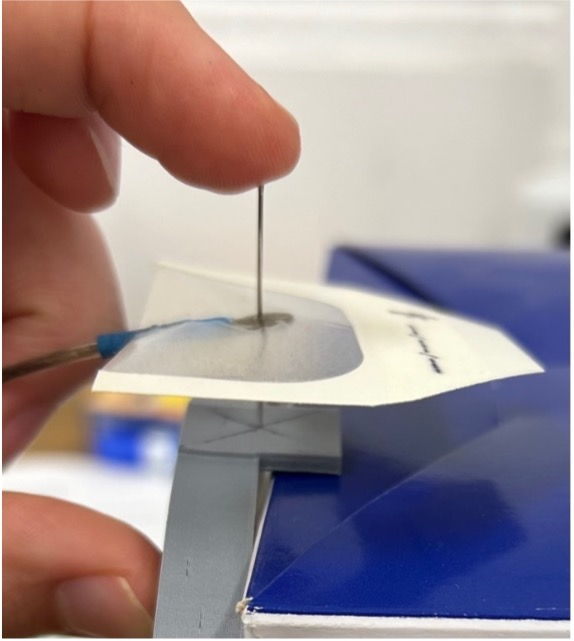

---
meta:
    author: Tim Bardouille and Clara Knox
    topic: MEG Phantom Assembly
---
# Open Source MEG Dry Phantom Assembly

 This document describes the step-by-step procedure of assembling the MEG Biosignal phantom. This is a “dry phantom” designed based on the principles described in publications by Oyama (2015, 2019) and in Hamalainen’s review (1993). Validation of an early prototype “free- wire” phantom design can be found in Bardouille et al., Sensors, 2024. 

## Technical Description

### The Phantom Construction

The phantom consists of a custom half-circle printed circuit board (PCB) glued to a 3D printed frame. The phantom coordinate frame is defined in Figure 1. The centre of the top surface of the printed frame is the origin of the phantom coordinate frame, with the top surface acting as the XY plane. One surface of the PCB hosts four isosceles triangles of wire, each with a 3-mm base, tangentially oriented with respect to the PCB’s rounded edge that makes the wire segment. The PCB sits in the XZ plane of the phantom coordinate frame. The wire segments are arranged at 15°, 25°, 60°, and 70° polar (theta) angles respectively, out 6.5 mm radially from the origin. Current runs up one long edge of the triangle, across the wire segment, and down the other edge. The magnetic fields due to the long edges essentially cancel each other out because the currents are anti-parallel and radially oriented to the closest sensors. Thus, the MEG sensors are predominantly sensitive to the 3-mm long stretch of current, which is effectively isolated in space. Four HPI coils are secured to equally spaced mounts forming a square in the XY plane. The HPI coils and wire segments are connected to twisted wires that connect to the circuit driver.

###The Current Driver Circuit and the Junction

A custom-built current driver circuit sends signals to each source. It generates a time-varying voltage signal. Resistors are used to then set the current through the HPI coils and wire segments, according to Ohm’s law. The resistance at R2 (See circuit diagram in Build Instructions section 11) can be adjusted by switching out resistors to obtain the desired current dipole magnitude. We suggest a resistance of 300,000 Ω for wire segments, corresponding to a theoretical current dipole magnitude of 17 nAm. The resistance in the wires to the HPI coils is set to 300,000 Ω. An 8 channel Relay Module allows the signal through to one source at a time. A 16-wire twisted ribbon cable runs from the circuit to a junction. Two male and female ribbon cable connectors make the ribbon cable easily detachable. The junction is built with two Protoboards. The twisted wires from the wire segments are soldered directly to a Protoboard, aligned with the female ribbon cable connector to pick up the signal from the ribbon cable. The HPI coil wires are connected to the other Protoboard using a connector for Elekta HPI coils. Eight 15-cm 22 AWG hook-up wires connect the HPI coil wires to the remaining channels of the ribbon cable.

# Use Instructions
## Set Up Guidelines
The phantom is placed inside the sensor array and the junction is hooked up to the current driver circuit via the ribbon cable. The junction can be within the magnetic shielding but should be at least 1m away from the sensor array to limit any magnetic interference. The current driver circuit must be completely outside of the magnetic shield.

## Activating the Sources

Our script instructs the circuit to deliver 100 pulses to each source (4 ECDs then 4 HPIs) consecutively. Each pulse is one half-cycle of a 5 Hz cosine wave. 

* Our driver script for Arduino (.INO file) can be found here in the [GitHub repository](https://github.com/tbardouille/MEG_biosignal_phantom "Link to GitHub repo") 
* Upload the script to the Arduino via USB. 
* The Arduino will immediately begin to send time varying current to the sources.
* Hit the Reset button the Arduino to restart the stimulus (i.e., when you start to capture MEG data) 

# Materials Required
## Phantom Head
* HPI coils (x4)
* Strands of thin magnet wire (~0.11 mm) long enough to go from the junction position to
the sensors and back. The junction should be at least 1 m from the sensors. (x4)
	- Example calculation: our junction sits 2 m away from the sensors, so we used 4
4-meter strands of wire.
* Stereolithography (.stl) file for 3D printing the platform:
* Gerber files for the printed circuit board:
## Circuit
* Arduino UNO R3
* 1 Digital-to-Analog Converter (MCP 4725 DAC)
* 8 Channel Relay Module (e.g., TS0012)
* Ribbon Cable female connector (3M157660-ND)
* 1LED
* 10nF Capacitor
* 2kΩ Resistor
* 300kΩ Resistor
* 100Ω Resistors (x8)
## Junction
* Protoboard (DKS-SOLDERBREAD-02-ND)
* Protoboard (1568-1652-ND)
* Ribbon cable female connector (3M157660-ND)
* Connector for Elekta HPI coils (WM3804-ND)
* 15cm 22 AWG hook-up wire segments (x8)
## Equipment
* 3D printer (we used an UltiMaker S3)
* Soldering iron
* Masking tape (for labeling)
* Pen (for labeling)
* Power Drill
* Screwdriver
* Tegaderm Film
* Needle
* 16-wire twisted ribbon cable (3M157968-100-ND)
* Ribbon cable male connectors (x2; 3M11965-ND)

# Building The Phantom

*	Print the Required Files 
	-	To print the PCB, use the gbr files
	-   To print the phantom frame, use an UltiMaker S3 or equivalent 3D printer to print the stl file (designed in FreeCAD)

*	Twist four sets of current carrying wires. 
    -   For each set:
		+	Measure and cut the necessary length of thin magnet wire for your set up. Example calculation: our junction sits 2 m away from the sensors, so we use a 4-meter-long strand of wire to make one set of twisted wires
		+	Fold the wire in half
		+	Tape the wires together about 10 cm away from the midpoint loop.
		+	Mount the power drill to a table so you can turn it on without it moving, or have another person hold the drill. 
		+	Pinch the two free ends of the wire in the chuck of the power drill. Have it so that the two halves of the wire strand are the same length and are fed through different gaps in the chuck. There should be no twists in the wire between the drill and the loop. 
		+	Hold the loop, apply light tension to the wires and turn the drill on, causing the wires to twist together. 
		+	Once the wires are sufficiently twisted, disconnect them from the drill and tape the end opposite the loop so that the twists don’t unravel
		+	Cut the loop open. You should have two pieces of wire twisted together. 
		+	Label all four wire ends with the same number: 1, 2, 3, or 4 corresponding to the four dipoles. 

*	Make a wire bundle from the 4 twisted wire sets
	-	Mount a screwdriver in the drill chuck with the handle sticking out. 
	-	Tape the ends of the sets of twisted wires to the handle of the screwdriver, evenly spaced. Tape them above the labels so the tape doesn’t get twisted in. 
	-	Hold the other ends of the twisted wire sets together such they are equally taut between your hand and the drill chuck.
	-	Ensure the wire sets aren’t tangled with each other.
	-	Apply light tension to the wires and turn the drill on, causing the wires sets to twist together. 
	-	Once the wires are twisted together, disconnect them from the drill. 
	-	Strip the ends of all the exposed wire tips (16 total) to prepare for soldering.

*	Attach wire bundle to PCB board
	-	Solder each twisted wire set to the corresponding solder points on the PCB board. 
	-	For example, the two exposed wires at one end of the twisted wire set labeled “1” should be soldered to Q1_in and Q1_out respectively

*	Glue the PCB to the phantom platform. 
	-	Put superglue on the inside of the posts on the platform. 
	-	Slide the PCB into the posts such that side with the solder points is touching the posts that are closer together.
	-	Allign the PCB with the edges of the platform so that it is centered along the “x” axis.
	-	Press the posts into the PCB and hold according to the instructions of the glue.

# Building The Circuit

* Wire up the main circuit to the Arduino as below using parts listed in the Materials Required / Junction section.

* Wire up the junction as below using parts listed in the Materials Required / Junction section.

*	Connect the junction to the circuit.
	+	Attach the male ribbon cable connectors to either end of the ribbon cable.
	+	Slide one male end of the ribbon cable into the female connector soldered to the junction and the other into the female connector of the current driving circuit. 

# HPI Coil Installation

* Number the mounts and HPIs
* Find the centre of the HPI mount by drawing two diagonal lines from corner to corner. The intersection is the centre of the mount.
* Cut the Tagederm film in half and remove the paper on the back.
* Place the coil on the sticky side of the Tagederm film.
* Pierce the Tagederm film with the wire so it goes through the Tagederm first then through the hole in the centre of the HPI coil. 
* Align the needlepoint with the centre of the mount. 
* Slide the HPI coil (with the attached Tagederm) down the needle, keeping the needlepoint centred on the mount.
* Pull the needle out. The HPI coil should now be centred on the mount

# References
M. Hamalainen, R.Hari, R. J. Ilmoniemi, J. Knuutila, O. V. Lounasmaa, “Magnetoencephalography Theory, Instrumentation, and Applications to Noninvasive Studies of the Working Human Brain”,Reviews of Modern Physics, vol. 65, (1993).

D. Oyama, Y. Adachi, M. Yumoto, I. Hashimoto, Gen Uehara, “Dry phantom for Magnetoencephalography - Configuration, calibration, and contribution”, Journal of Neuroscience Methods, vol. 251, (2015).

D. Oyama, Y. Adachi and G. Uehara, "Dry Phantoms with Deep Signal Sources for Magnetoencephalography," IEEE Magnetics Letters, vol. 10, (2019).

T. Bardouille, V. Smith, E. Vajda, C. D. Leslie, N. Holmes, “Noise Reduction and Localization Accuracy in a Mobile Magnetoencephalography System”, Sensors, vol. 24, (2024).

