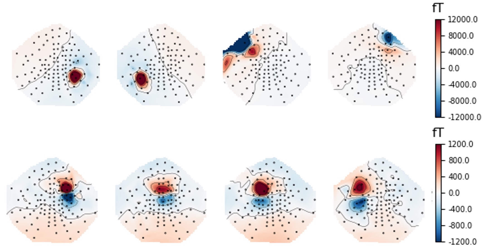
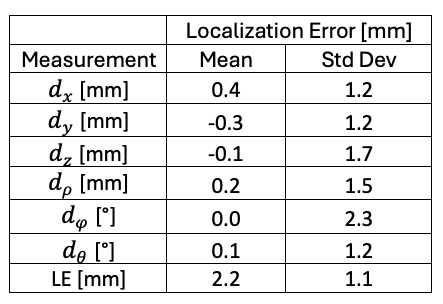

# An open source phantom for MEG

## Consistent measurement of localization error across sites

### Motivation

Magnetoencephalography (MEG) is used to localize sources of neuronal activity, where the current dipole is the fundamental model used to estimate the sources in the brain. There is no ground truth for the accuracy and precision of localization of such sources within the brain, so it is imperative to have an independent quantification of an MEG system’s source localization accuracy. Localization error can be assessed with a phantom - a device that contains small current elements (wire segments) with known position and orientation. The wire segments can be localized based on MEG data capturing their activation (using a current dipole model). This provides a useful estimate of uncertainty in MEG results and a platform to compare performance based on hardware or software innovations. 

We have developed a simple dry phantom. Here, we share the build instructions and validation results, to provide a common platform for measuring MEG system performance. 

## Relating Phantom Design to Human MEG Scans

The phantom has two types of sources:  short, straight wire segments (modelled as current dipoles) to simulate brain activity and small wire loops (modelled as magnetic dipoles) to simulate head tracking. The small loops are equivalent to the head position indicator (HPI) coils, which are activated to estimate the position and orientation of the head (or phantom) within the helmet coordinate frame. The localization of our four HPI coils defines the transformation between helmet and phantom coordinate frames. We have designed a dry phantom that uses four narrow isosceles triangles of wire, where the short edge of the triangle is the wire segment that simulates brain activity. The wire segments generate magnetic field changes that are equivalent to brain activity. The MEG data can be used to estimate the position and orientation of simulated brain activity in the helmet coordinate frame. These locations are transformed to give the wire segment position and orientation in the phantom coordinate frame, and these transformed values are compared to the expected values.  This use case of the phantom mimics head tracking and source localization in MEG, so that phantom quantification of localization accuracy can be transferred to human recordings.

## What is in this repository?

* <b>README.md</b> - this file
* <b>phantomVersion1</b> - folder containing the first version of the PCB phantom
	+ Build Instructions.md - markdown instructions for building the phantom
	+ phantom-Platform.stl - a 3D printable file containing the phantom platform
	+ gerbers - a folder containing files necessary to print the printed circuit board (PCB)
	+ phantomDrive_V4.ino - Arduino code to run the current driver (i.e., activate sources)
	+ Circuit Layout.png - a circuit diagram for the current driver 
	+ designFiles - a folder containing FreeCAD and KiCAD design files
	+ if you edit the design, please share this back to the repo (<b>under Contributors</b>)
* <b>pictures</b> - a folder including pictures used in markdown files
* <b>Results</b> - markdown files describing findings with various phantom builds
* <b>Contributors</b> - a folder for contriibuting sites to keep their development files

## Validation Results

Validation data was acquired at the Biosignal Lab at Dalhousie University (Halifax, NS, Canada). We used 16 Fieldline v2 single-axis OPM sensors inside of a 2-layre mu-metal shielded cylinder. The sensor helmet had 107 slots - we made consecutive recordings of the phantom with sensors in different slots to capture whole-head MEG data.  The phantom was mounted directly onto the helmet using 3D printed mounting pieces to attach it to 3 of the sensor slots - enabling consistent phantom platform position across recordings. One whole-head recording was the compilation of eight acquisition runs with sensors in different helmet slots each time to cover 94 total sensor positions (after lost data). Data was recorded at 1000 Hz. The current driver was set to provide 17 nAm. Dipole locations are all 6.50 cm from the origin. Polar angles are -60, -15, 25, and 70 degrees. 

Below, we show representative field topographies for the HPI coils (top row) and wire segments (bottom row), averaged over 100 epochs and centered at the peak of the pulses that were delivered. 

HPI and ECDs were localized. HPI data were used to establish the phantom to MEG coordinate frame transformation. ECDs were localized in the MEG coordinate frame and positions were transformed to the phantom coordinate frame (i.e., absolute localization error). The table below shows difference between the estimated and known position across all ECDs, in Cartesian and spherical coordinate frames. As well, the straight-line localization error is shown. 

Our phantom acheives 2.2 +/- 1.1 mm localization error, with no evidence of systematic error (i.e., bias) in any dimension.

