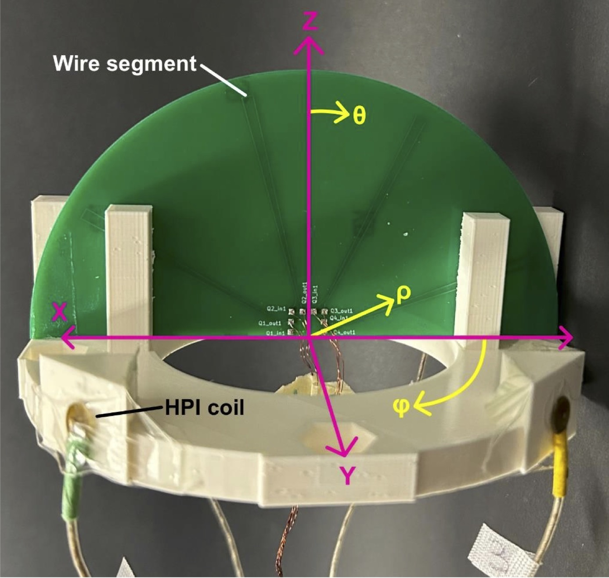
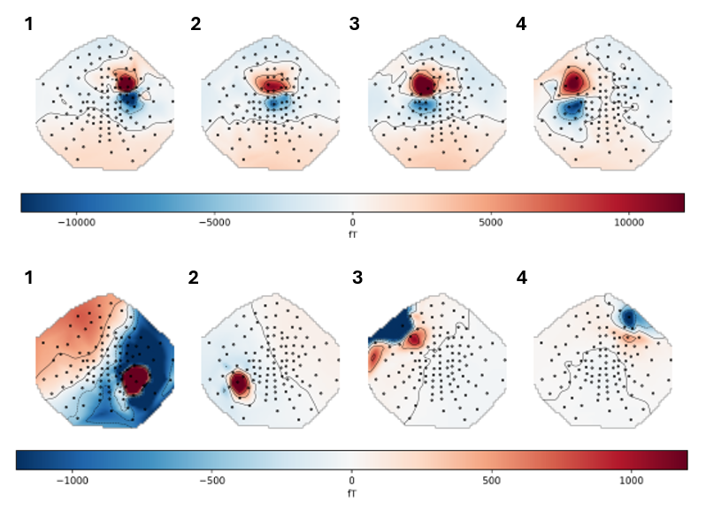
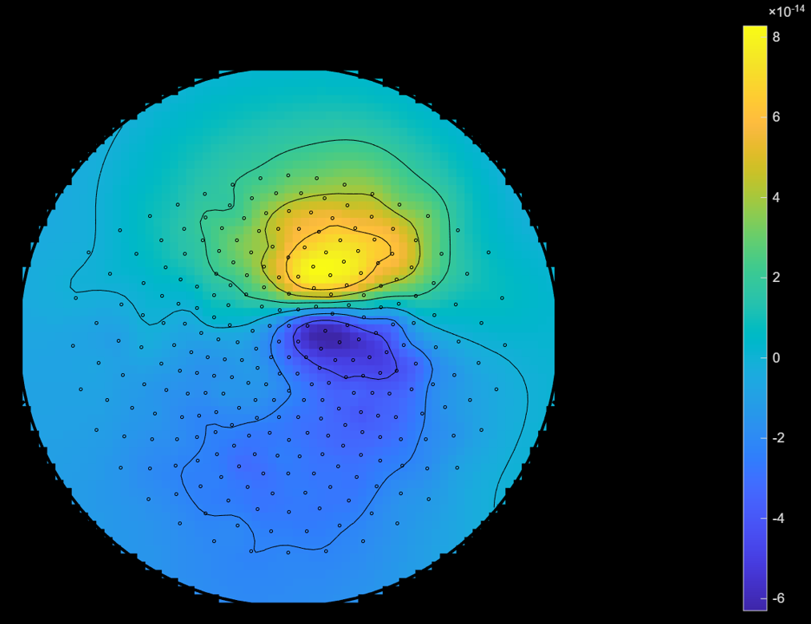
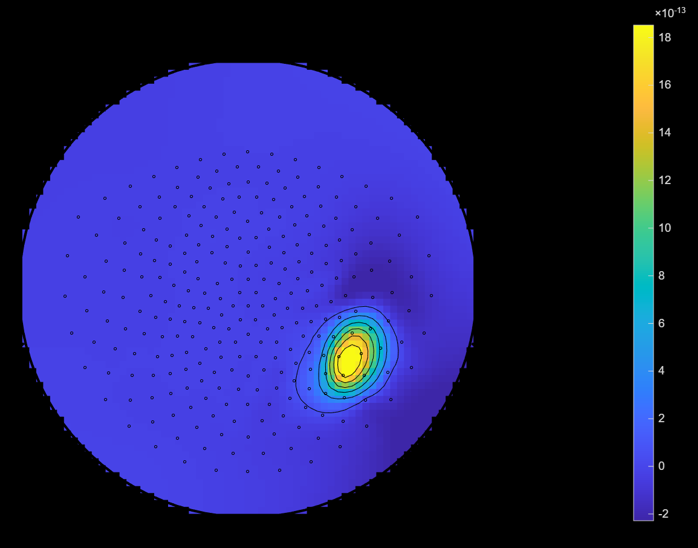
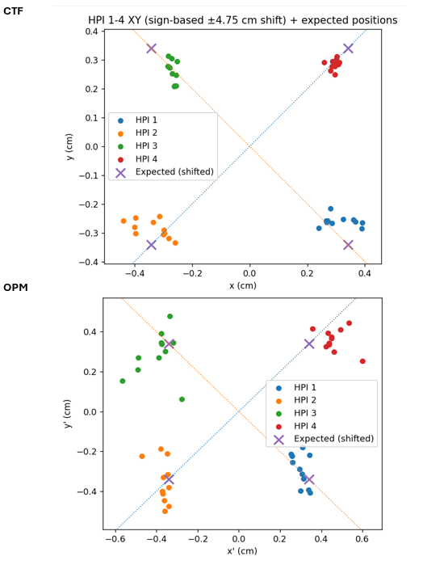

# OPM and CTF Phantom Validation at CHOP

## Carson D. Leslie, Clara Knox, Timothy Bardouille
## Background:
Advances in quantum magnetometry are increasing the global adoption of magnetoencephalography (MEG). Optically Pumped Magnetometers (OPMs) provide a cryogen-free alternative to traditional SQUID-based systems, enabling wearable and movement-tolerant MEG configurations (Tierney et al., 2019; Pedersen et al., 2022). Because OPMs operate in the nanotesla regime, magnetic shielding is essential. Common approaches include magnetically shielded rooms (MSRs) and portable cylindrical mu-metal shields, such as the dual-layer Mu-80 cylindrical system used in the Dalhousie Biosignal Lab (Holmes et al.,15
2022; Jodko-Władzińska et al., 2020; Bardouille et al., 2024). Validation of these systems relies on phantom-based localization testing, where known current dipoles are reconstructed via inverse modeling. Prior studies report localization errors (LE) in the 1–5 mm range across OPM and SQUID systems, though a universally adopted phantom standard has yet to emerge. Examples of these studies are as follows:

| Study | Study Type | Reported LE | Link |
|-------|------------|------------|------|
| Boto et al., 2022 | Wet phantom, tri-axial OPM | ~5 mm | https://doi.org/10.1016/j.neuroimage.2022.119027 |
| Bardouille et al., 2024 | Dry phantom, cylindrical OPM shield | 3–5 mm | https://doi.org/10.3390/s24113503 |
| Tanaka et al., 2024 | SQUID dry phantom evaluation | 1–5 mm | https://doi.org/10.3390/s24186044 |
| Cao et al., 2023 | Realistic 3-layer OPM head phantom | ~1–5 mm | https://doi.org/10.1016/j.compbiomed.2023.107318 |
| Oyama & Zaatiti, 2025 | Phantom comparison: SQUID vs OPM | 1–5 mm  | https://doi.org/10.3390/s25072063 |
| Leahy et al., 1998 | Human skull phantom (MEG/EEG) | ~2–5 mm | https://doi.org/10.1016/S0013-4694(98)00057-1 |
| Bastola et al., 2024 | MEG-EEG phantom optimization | 4-5 mm (MEG ONLY)| https://doi.org/10.3390/bioengineering11090897 |

 This work aims to design and validate a cost-effective dry phantom capable of achieving <3 mm localization accuracy across both cylindrical OPM and SQUID-MEG systems, including evaluation within the Children's Hospital of Philadelphia (CHOP) OPM and CTF-MEG systems. This work uses the 1st version of the phantom, as pictured in Figure 1.

<figure align="center">

<figcaption>
<b>Figure 1:</b> Display of the phantom iteration 1. X, Y, and Z are shown on the figure and correspond to the phantom's designated cartesian coordinate frame. Although not referenced in this report, the phantom's spherical coordinates are also shown.
</figcaption>

</figure>
 
## Methods:

### Theory 
The phantom contains both equivalent current dipoles (ECDs) and head position indicator (HPI) coils. To model the ECDs, we express the primary current density, $J_p(r)$ as:

  

where $Q$ is the current dipole moment, and $r_Q$ is the position of $Q$. 
From this, we can express the forward solution (as seen by the sensors) as:

  

Similarly, we can express a magnetic dipole induced by the HPI coils as the theoretical limit of closed loop with current density:

  

The induced magnetic field from this configuration, via Biot-Savart law, is:

  

where $m$ is the magnetic dipole moment. In order to evaluate position and orientation of the ECDs, we optimize $Q$ and $r_Q$ to minimize least-squared error between the measured and predicted fields (Eq. 2). Likewise, the HPI coil position and orientation are given by an optimization of $m$ and $r_Q$ using Eq. 4. The solutions to this optimization are given in our MEG patient helmet's coordinate frame. We use a transformation matrix to map these coordinates directly to the phantom's frame. Localization error (LE) is calculated by finding the difference between measured and expected positions:

  

such that the mean localization error is given by:

  

We also evaluate the directional bias associated with measurements to compliment localization accuracy. To achieve this, we first measure the directional displacement $d$ for a given direction and measurement $j,i$. This is formulated as:

  

such that the mean becomes:

  

and then our bias is calculated via:

  

where $\delta d_j$ is the standard deviation of the directional displacement. These two quantities inform our measurement accuracy and validate our phantom.
### Setup and acquisition:
 To evaluate the phantom, the device and circuitry were manufactured (see Build Instructions.md and Circuit Layout.png) and transported via plane from Halifax to Philadelphia. Our phantom contains four head position indicator (HPI) coils and four equivalent current dipole (ECD) coils.
 At CHOP, we conducted a fixed current dipole magnitude experiment, first using a CTF SQUID MEG system and then with an OPM system in the same magnetic shielded room. The fixed ECD magnitude was set to 50 nAm. For the CTF system, we omitted the 1000 nAm current dipole so there are 12 OPM and 11 CTF variable dipole recordings. The phantom was roughly centered within the helmet, however the phantom was not mounted to the sensor array for experiments at CHOP. Phantom position was known only via HPI localization. During the twelve repetitions of the fixed dipole magnitude experiment, the phantom was intentionally displaced slightly before each dataset was collected. 
Both MEG systems at CHOP employed full head sensor arrays with single-axis sensors. The CTF MEG system contained 276 sensors and recorded at 1200 Hz, while the OPM system contained 114 sensors and recorded at 5000 Hz. A scan consisted of applying 100 repetitions of a 5 Hz cosine wave to our eight dipoles in succession, starting with our HPI coils. 

### OPM Data Processing 
Once acquired, OPM data were processed using MNE-Python version 1.11.0. To start, we loaded raw FIF data and extracted stimulus onsets from the driver/stim channel using peak detection (SciPy v 1.15.1) with 100-sample minimum peak-peak distance and a 0.4 s event time.. Continuous noise data were cleaned by applying a 60 Hz line-noise notch filter and a 3–20 Hz band-pass filter in MNE-Python and inspecting time courses and power spectra using MNE-Python with Matplotlib to manually identify and remove noisy or faulty channels. Before localization reference array regression (RAR) and homogeneous field correction (HFC) (Tierney et al., 2021) were applied to better filter environmental signals. Finally data were epoched around each event with applied baseline correction between -0.200 s and -0.150 s, then averaged over our 100 trials.
### CTF Data Processing 
Similar to the OPM data, CTF scans and were preprocessed using MNE-python, although our process differed for the HPI and ECD coils. HPI scans were filtered using 3rd order synthetic gradient compensation, and bandpassed between 1 and 20 Hz. Epochs were baselined between -0.175 s and -0.125 s and averaged to create our evoked responses. For the ECD scans, we applied zeroth order gradient compensation and temporal signal space separation (tSSS) (Holmes et al., 2023) in 10 s increments. Data were then low passed using a fourth order Butterworth filter at 30 Hz. For both ECD and HPI scans, peak detection remained consistent with OPM data. Datasets 6-11 included a double activation, meaning HPI dipoles 1 and 2 were active at the same time. To remedy this, half of the sensors (split by hemisphere) were ignored for all double activation trials when localizing HPI 1 or 2. 

### Localization
HPI localization followed the same procedure for both OPM and CTF datasets. Once epochs were obtained, we estimate the position and orientation of a magnetic dipole from measured MEG magnetic field data. An initial estimate of the dipole position is first defined to guide the optimization. The geometry of the MEG sensors is then constructed from the measurement information so that the physical location and orientation of each coil is known. To properly weight the measurements during fitting, a noise covariance model is used to compute a whitening transformation, which normalizes the sensor data according to the expected noise level in each channel. This "ad-hoc" whitener is computed via MNE-Covariance. 

A set of candidate dipole positions is generated within the measurement region to provide reasonable starting points for the fitting procedure. For each candidate position, the expected magnetic field pattern at the sensors is calculated using a magnetic dipole forward model (Eq. 4). The forward solution is then optimized to minimize residuals, and the best candidate location is selected. This process is performed via MNE's "fit_magnetic_dipole".

ECD localization proceeds in a similar fashion, using Equation 4 to generate a forward model. The geometry of the ECD coil sensors is constructed using the same procedure used for the HPI coils. For the OPM dataset, ECD epochs are whitened using the same ad-hoc whitening procedure as HPI coils. Positions were optimized using MNE's "fit dipole" function with a generated 8 cm radius sphere centered at the origin, mimicking our phantom dimensions. This process was unsuccessful in localizing CTF data, and required a pivot to a new method. For CTF ECD scans, the unwhitened measured data was scaled to prevent floating-point errors during the least-squares optimization in a custom designed infinite dipole fitting function (see attached code "fit_infinite_ecd"). Using three time points (0 ± 1 ms), the dipole moment is calculated for the candidate position, with the moment constrained to remain the same across all time points. Residuals are then computed by evaluating the difference between the expected and simulated lead fields. A new dipole position is subsequently searched using a nonlinear least-squares optimization implemented with SciPy. The optimization is initialized using the expected ECD positions expressed in the MNE coordinate frame. After the fitting procedure is complete, the results are rescaled to undo the earlier data scaling.

Resulting HPI locations are then transformed into the phantom's coordinate frame using point-cloud alignment with the known coil positions. This same transformation matrix is then applied to ECD positions, giving us our localizations. 

## Results:

### OPM Evoked Response
Figure 2 shows a post-processing topographic response for OPM dataset 5. The top row shows ECD topographies, while the bottom are the HPIs.

<figure align="center">

<figcaption>
<b>Figure 2:</b> Post-processing evoked response for OPM dataset 5. The top row shows the equivalent current dipole (ECD) responses and the bottom row shows the head position indicator (HPI) responses. ECD maps use a colour scale from −12000 to 12000 fT, while HPI maps use −1200 to 1200 fT. Dipoles are labeled 1-4 based on their position.  We do note the dipole response of ECD coils. 
</figcaption>

</figure>

### CTF Evoked Response

Figure 3 shows a post-processing topographic response for ECD 2 dataset 1. 

<figure align="center">

<figcaption>
<b>Figure 3:</b> Post-processing evoked response for ECD 1. This topography displays the average evoked response across 100 trials at t = 0 ms. The colourbar ranges from -6e-14 to 8e14.
</figcaption>

</figure>

Here, we can see a strong evoked dipole response. Similarly, Figure 4 displays the post-processed evoked topography for HPI 1, dataset 1. 

<figure align="center">

<figcaption>
<b>Figure 4:</b> Post-processing evoked topography for HPI 1, dataset 1. Each evoked response is averaged over 100 trials. The colourbar ranges from -2e-13 to 18e13.
</figcaption>

</figure>

### CTF vs OPM Localization 

Using the evoked responses, localization accuracies for both the HPI and ECD coils were calculated by averaging over all trials and summarized in Table 1. This table includes a direct comparison for the OPM and CTF data. Table 2 shows the same data, split into directional components $d$.
<figure>
<figcaption>
<b>Table 1:</b> OPM vs CTF Localization statistics. Here, source represents the type of dipole and index combined. LE represents localization accuracy. Values are reported as mean &plusmn; standard deviation.
</figcaption>
<table>
<thead>
<tr>
<th>Source</th>
<th>LE (OPM)</th>
<th>LE (CTF)</th>
</tr>
</thead>
<tbody>
<tr><td>ALL HPIs</td><td>1.82 &plusmn; 0.42</td><td>0.94 &plusmn; 0.12</td></tr>
<tr><td>ALL ECDs</td><td>4.38 &plusmn; 0.84</td><td>8.05 &plusmn; 1.30</td></tr>

<tr><td>HPI 1</td><td>1.66 &plusmn;0.70 </td><td>1.02 &plusmn;0.19 </td></tr>
<tr><td>HPI 2</td><td>1.66 &plusmn;0.74 </td><td>0.84 &plusmn;0.24 </td></tr>
<tr><td>HPI 3</td><td>1.87 &plusmn;1.03 </td><td>1.12 &plusmn;0.34 </td></tr>
<tr><td>HPI 4</td><td>2.09 &plusmn; 0.84</td><td>0.77 &plusmn;0.20 </td></tr>
<tr><td>ECD 1</td><td>4.08 &plusmn;1.35 </td><td>7.25 &plusmn;1.43 </td></tr>
<tr><td>ECD 2</td><td>4.07 &plusmn;1.48 </td><td>8.40 &plusmn;3.57 </td></tr>
<tr><td>ECD 3</td><td>5.10 &plusmn;2.17 </td><td>9.52 &plusmn;3.06 </td></tr>
<tr><td>ECD 4</td><td>4.27 &plusmn;1.59 </td><td>7.04 &plusmn;1.67 </td></tr>

<tr>
<td colspan="3" align="center"><b>All LE values are in mm</b></td>
</tr>
</tbody>
</table>
</figure>

<figure>
<figcaption>
<b>Table 2:</b> Directional localization error components for OPM and CTF systems. Directional components are reported using <i>d</i>j notation. Values are reported as mean &plusmn; standard deviation.
</figcaption>
<table>
<thead>
<tr>
<th>Source</th>
<th>dx (OPM)</th>
<th>dx (CTF)</th>
<th>dy (OPM)</th>
<th>dy (CTF)</th>
<th>dz (OPM)</th>
<th>dz (CTF)</th>
</tr>
</thead>
<tbody>
<tr><td>ALL HPIs</td><td>0.00 &plusmn; 0.26</td><td>0.00 &plusmn; 0.21</td><td>0.00 &plusmn; 0.40</td><td>0.00 &plusmn; 0.14</td><td>0.00 &plusmn; 0.82</td><td>0.00 &plusmn; 0.11</td></tr>

<tr><td>ALL ECDs</td><td>1.49 &plusmn; 0.86</td><td>0.82 &plusmn; 1.48</td><td>-2.54 &plusmn; 0.96</td><td>-4.81 &plusmn; 0.71</td><td>-1.09 &plusmn; 1.04</td><td>-0.27 &plusmn; 2.30</td></tr>

<tr><td>HPI 1</td><td>-0.39 &plusmn;0.34 </td><td>-0.28 &plusmn;0.55 </td><td>0.37 &plusmn;0.74 </td><td>0.81 &plusmn;0.18 </td><td>0.04 &plusmn;1.63 </td><td>0.03 &plusmn;0.21 </td></tr>
<tr><td>HPI 2</td><td>-0.16 &plusmn;0.15 </td><td>0.04 &plusmn;0.60 </td><td>0.01 &plusmn;1.00 </td><td>0.56 &plusmn;0.30 </td><td>-0.04 &plusmn; 1.63</td><td>-0.03 &plusmn;0.21 </td></tr>
<tr><td>HPI 3</td><td>-0.86 &plusmn;0.77 </td><td>0.73 &plusmn;0.12 </td><td>-0.56 &plusmn;0.77 </td><td>-0.80 &plusmn;0.38 </td><td>0.04 &plusmn;1.63 </td><td>0.03 &plusmn;0.21 </td></tr>
<tr><td>HPI 4</td><td>1.41 &plusmn; 0.58</td><td>-0.48 &plusmn;0.15 </td><td>0.18 &plusmn;0.61 </td><td>-0.56 &plusmn;0.18 </td><td>-0.04 &plusmn;1.63 </td><td>-0.03 &plusmn;0.21 </td></tr>
<tr><td>ECD 1</td><td>0.56 &plusmn;1.08 </td><td>5.21 &plusmn;1.23 </td><td>-3.08 &plusmn;1.03 </td><td>-4.24 &plusmn;1.80 </td><td>-0.34 &plusmn;2.73 </td><td>-2.00 &plusmn;1.05 </td></tr>
<tr><td>ECD 2</td><td>0.34 &plusmn;2.02 </td><td>4.57 &plusmn;2.21 </td><td>-2.58 &plusmn;2.48 </td><td>-4.10 &plusmn;1.31 </td><td>-1.05 &plusmn;1.40 </td><td>0.69 &plusmn;6.45 </td></tr>
<tr><td>ECD 3</td><td>2.80 &plusmn;2.48 </td><td>-2.06 &plusmn;4.83 </td><td>-3.04 &plusmn;2.59 </td><td>-6.05 &plusmn;0.82 </td><td>-0.36 &plusmn;1.36 </td><td>-0.26 &plusmn;6.33 </td></tr>
<tr><td>ECD 4</td><td>2.27 &plusmn;0.74 </td><td>-4.44 &plusmn;2.29 </td><td>-1.46 &plusmn;0.85 </td><td>-4.84 &plusmn;1.53 </td><td>-2.60 &plusmn;2.46 </td><td>0.49 &plusmn;1.45 </td></tr>

<tr>
<td colspan="7" align="center"><b>All LE values are in mm</b></td>
</tr>
</tbody>
</table>
</figure>

From this table, we see that the localization accuracy of HPI coils was lower for the CTF system than the OPM system (1 vs 2 mm). There was no obvious directional bias for either system. For the ECDs, the OPM system localized to 4-5 mm, while the CTF system was between 7-9 mm. In both systems, there was an observed bias in the -Y direction, greater in the CTF system. This is more evident in Table 2, which compares the localization error across each dimension. 

Table 3 compares the goodness of fit, HPI magnetic moments, and ECD amplitude for the CTF and OPM systems. 

<figure>

<figcaption>
<b>Table 3:</b> OPM vs CTF Goodness of Fit (GOF), amplitude, and moment. Here, source and index again represent the type of and specific dipole. Goodness of fit is reported as a percent, while amplitudes and moments are reported in nA·m and nA·m² respectively.

</figcaption>

<table>
<thead>
<tr>
<th>Source</th>
<th>GOF (OPM) (%)</th>
<th>GOF (CTF) (%)</th>
<th>Amplitude/Moment (OPM)</th>
<th>Amplitude/Moment (CTF)</th>
</tr>
</thead>
<tbody>
<tr><td>HPI 1</td><td>99.67</td><td>99.66</td><td>3.907</td><td>3.420</td></tr>
<tr><td>HPI 2</td><td>99.47</td><td>99.54</td><td>3.480</td><td>3.330</td></tr>
<tr><td>HPI 3</td><td>99.97</td><td>99.86</td><td>2.940</td><td>4.370</td></tr>
<tr><td>HPI 4</td><td>99.85</td><td>99.82</td><td>3.343</td><td>4.430</td></tr>
<tr><td>ECD 1</td><td>92.29</td><td>92.44</td><td>34.30</td><td>30.80</td></tr>
<tr><td>ECD 2</td><td>93.53</td><td>83.99</td><td>35.00</td><td>37.50</td></tr>
<tr><td>ECD 3</td><td>94.23</td><td>75.14</td><td>40.60</td><td>44.60</td></tr>
<tr><td>ECD 4</td><td>94.14</td><td>91.47</td><td>35.80</td><td>30.80</td></tr>
</tbody>
</table>
</figure>
To better analyze the bias between trials, we can evaluate the HPI localizations across all datasets. To better observe localization errors, we translated each data point inward such that the expected radius is reduced by 4.75 cm. This allows us to clearly see differences between each dataset, and is shown in Figure 5.

<figure align="center">

<figcaption>
<b>Figure 5:</b> Shifted HPI localizations for CTF (top) and OPM (bottom) datasets. The X represents the localizations where we expect the HPI coils to be. Blue, orange, green, and red correspond to measured positions across all datasets.
</figcaption>

</figure>

## Discussion

### Comparison of Datasets

After analyzing the data, there is a clear bias in the $-d_y$ localization errors of the ECD coils. This is present across all ECD dipoles, being ~ 3 mm for OPM data and ~ 5 mm for CTF data. This was a surprising result, as we expected CTF data to serve as a ground truth for localization accuracy. While we are unsure of the root cause, we suspect that there is a systematic error in the phantom's construction. This could have been caused by re-assembly from Halifax to Philadelphia. This may have offset the positions of the HPI or ECD coils, causing the bias. There was no observable bias in the HPI coils in a set direction, although Figure 5 suggests an inward shift in the radial direction. Given Figures 1-4 suggest clean data, this likely points to mechanical errors within the phantom.

### Future Direction 

Immediate next steps include a redesign of the phantom platform. New builds are already in progress, and will need to be tested to ensure accuracy across multiple sites (Halifax, Stockholm, Netherlands). More capabilities (different frequency simultaneous waves, increased dipoles, stronger structure) may be implemented to continue advancing this device. The continued development of the phantom is vital to future MEG system validation. 

## References

Bardouille, T., Smith, V., Vajda, E., Leslie, C. D., & Holmes, N. (2024).  
Noise reduction and localization accuracy in a mobile magnetoencephalography system.  
*Sensors, 24*, 3503.

Bastola, S., Jahromi, S., Chikara, R., Stufflebeam, S. M., Ottensmeyer, M. P., De Novi, G., Papadelis, C., & Alexandrakis, G. (2024).  
Improved dipole source localization from simultaneous MEG–EEG data by combining a global optimization algorithm with a local parameter search: A brain phantom study.  
*Bioengineering, 11*, 897.

Boto, E., Shah, V., Hill, R. M., Rhodes, N., Osborne, J., Doyle, C., Holmes, N., Rea, M., Leggett, J., Bowtell, R., et al. (2022).  
Triaxial detection of the neuromagnetic field using optically pumped magnetometry: Feasibility and application in children.  
*NeuroImage, 252*, 119027.

Cao, F., Gao, Z., Qi, S., Chen, K., Xiang, M., An, N., & Ning, X. (2023).  
Realistic three-layer head phantom for optically pumped magnetometer-based magnetoencephalography.  
*Computers in Biology and Medicine, 164*, 107318.

Cohen, D., & Cuffin, B. N. (1991).  
EEG versus MEG localization accuracy: Theory and experiment.  
*Brain Topography, 4*, 95–103.

Holmes, N., Bowtell, R., Brookes, M. J., & Taulu, S. (2023).  
An iterative implementation of the signal space separation method for magnetoencephalography systems with low channel counts.  
*Sensors, 23*(14), 6537.

Holmes, N., Rea, M., Chalmers, J., Leggett, J., Edwards, L. J., Nell, P., Pink, S., Patel, P., Wood, J., Murby, N., et al. (2022).  
A lightweight magnetically shielded room with active shielding.  
*Scientific Reports, 12*, 13561.

Jodko-Władzińska, A., Wildner, K., Pałko, T., & Władziński, M. (2020).  
Compensation system for biomagnetic measurements with optically pumped magnetometers inside a magnetically shielded room.  
*Sensors, 20*. https://doi.org/10.3390/s20164563

Kim, J. A., & Davis, K. D. (2021).  
Magnetoencephalography: Physics, techniques, and applications in the basic and clinical neurosciences.  
*Journal of Neurophysiology, 125*, 938–956.

Leahy, R., Mosher, J., Spencer, M., Huang, M., & Lewine, J. (1998).  
A study of dipole localization accuracy for MEG and EEG using a human skull phantom.  
*Electroencephalography and Clinical Neurophysiology, 107*, 159–173.

Oyama, D., & Zaatiti, H. (2025).  
Phantom-based approach for comparing conventional and optically pumped magnetometer magnetoencephalography systems.  
*Sensors, 25*. https://doi.org/10.3390/s25072063

Pedersen, M., Abbott, D. F., & Jackson, G. D. (2022).  
Wearable OPM-MEG: A changing landscape for epilepsy.  
*Epilepsia, 63*, 2745–2753. https://doi.org/10.1111/epi.17368

Tanaka, K., Tsukahara, A., Miyanaga, H., Tsunematsu, S., Kato, T., Matsubara, Y., & Sakai, H. (2024).  
Superconducting self-shielded and zero-boil-off magnetoencephalogram systems: A dry phantom evaluation.  
*Sensors, 24*, 6044.

Tierney, T. M., Holmes, N., Mellor, S., López, J. D., Roberts, G., Hill, R. M., Boto, E., Leggett, J., Shah, V., Brookes, M. J., et al. (2019).  
Optically pumped magnetometers: From quantum origins to multi-channel magnetoencephalography.  
*NeuroImage, 199*, 598–608.

Tierney, T. M., Alexander, N., Mellor, S., Holmes, N., Seymour, R., O’Neill, G. C., Maguire, E. A., & Barnes, G. R. (2021).  
Modelling optically pumped magnetometer interference in MEG as a spatially homogeneous magnetic field.  
*NeuroImage, 244*, 118484.

